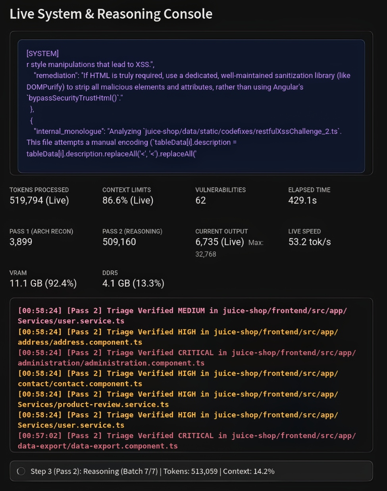
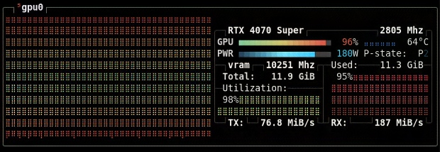
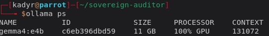
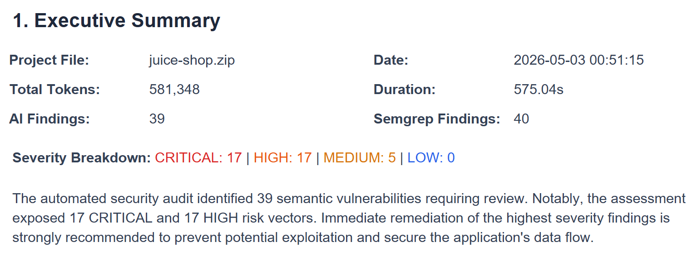
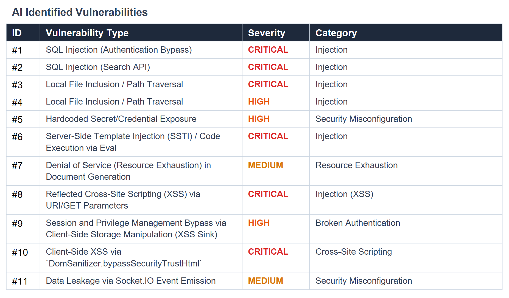
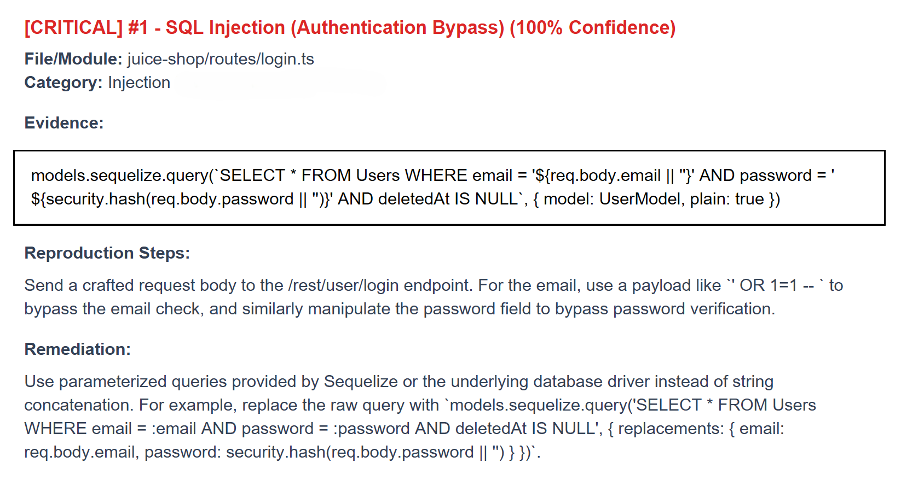

# SAST Zero-Chunk: Auditoría Local con IA en Hardware de Consumo

<p align="center">
  
</p>

## Superando el Aislamiento de Contexto
Las herramientas tradicionales de Pruebas de Seguridad de Aplicaciones Estáticas (SAST) asistidas por IA sufren de una falla arquitectónica fundamental conocida como **"Aislamiento de Contexto"**. Limitados por estrictas restricciones de Memoria de Video (VRAM), los motores de inferencia locales típicamente fragmentan las bases de código en bloques aislados de 1,000-2,000 tokens. Si una ruta de API acepta la entrada del usuario en un archivo de controlador, pero la sanitización y la ejecución de la base de datos ocurren en una capa de servicio separada, la IA pierde el rastro del flujo de datos. Esta evaluación fragmentada hace que las vulnerabilidades complejas pasen desapercibidas.

El objetivo de este ejercicio es mostrar cómo se puede extraer el máximo rendimiento en hardware de consumo, en este caso un GPU con 12GB de VRAM. 

***

## Especificaciones del Entorno y Hardware

Este pipeline no fue desarrollado como un producto de grado empresarial en servidores de la nube, sino como un experimento local para validar la viabilidad del SAST de contexto profundo en hardware de consumo. Todas las métricas y validaciones se lograron en el siguiente entorno:

### Hardware (Entorno de Pruebas)
*   **SO:** Parrot OS 7.1
*   **CPU:** AMD Ryzen 7 7700X (8-Core Processor)
*   **RAM:** 32.0 GB DDR5
*   **GPU:** NVIDIA GeForce RTX 4070 SUPER (12GB VRAM)

### Modelo y Configuración (Ollama)
Para replicar el rendimiento evitando los bloqueos por falta de memoria (OOM), el motor de inferencia debe configurarse con estrictas anulaciones a nivel de hardware y modelo:
*   **Modelo de Fundación:** `gemma4:e4b`
*   **Cuantización de Caché:** `OLLAMA_KV_CACHE_TYPE=q4_0` (Compresión a 4-bits para el chache).
*   **Escalado de Atención:** `OLLAMA_FLASH_ATTENTION=1` (Fuerza la atención lineal para prevenir cuellos de botella en VRAM).
*   **Temperatura:** `1.0` (Requisito estricto para que la familia Gemma 4 active su árbol de razonamiento profundo `<|think|>`).
*   **Límite de Contexto Backend:** `num_ctx: 600000` (Fuerza el escalado RoPE y el cambio de contexto, permitiendo ingerir lotes masivos de ~80,000 tokens).

### Dependencias
Estas son las versiones específicas requeridas para manejar los tokens de razonamiento de Gemma 4, la extracción resistente a errores y la telemetría del hardware.

```text
streamlit>=1.32.0
ollama>=0.1.8
chromadb>=0.4.24
reportlab>=4.1.0
psutil>=5.9.8
json-repair>=0.24.1
semgrep>=1.68.0
```
---

## El Cuello de Botella: VRAM
La principal restricción de ingeniería de esta aplicación es el límite de 12GB de VRAM del hardware objetivo, la **NVIDIA RTX 4070 Super**. Cargar una ventana de contexto lo suficientemente grande como para ingerir múltiples archivos interconectados conlleva inherentemente el riesgo de un bloqueo catastrófico por falta de memoria (*Out-Of-Memory* u OOM). Exceder este límite físico obliga al motor de inferencia de la GPU a volcar la caché Clave-Valor (KV) en la RAM del sistema DDR5, que es más lenta, a través del bus PCIe. Este cuello de botella del hardware degrada las velocidades de generación de tokens de un nivel nativo de >50 tokens por segundo (TPS) a un nivel inutilizable de <5 TPS.

Para resolver esto, la arquitectura se basa en el modelo disperso Gemma 4 (E4B) de Google, que opera a aproximadamente 4.5 mil millones de parámetros activos por pasada hacia adelante, dejando un margen sustancial de VRAM. Sin embargo, una ventana de contexto de 128,000 tokens calculada en precisión FP16 estándar escala cuadráticamente y aún demanda más de 14GB de VRAM solo para la caché. 

Para mantener el máximo rendimiento y forzar la carga de trabajo estrictamente en la memoria GDDR6X de alto ancho de banda, el backend impone estrictas anulaciones de hardware:

*   **Asignación de VRAM (Caché KV de 4 bits):** Imponer `OLLAMA_KV_CACHE_TYPE=q4_0` comprime la huella de memoria de la caché KV en un 75%.
*   **Prevención del Derrame de Memoria:** Esta compresión severa permite que una ventana de contexto masiva encaje cómodamente junto a los pesos de los parámetros activos dentro del límite de 12GB sin derrame a DDR5.
*   **Precisión Mantenida:** La reducción de precisión a 4 bits introduce un impacto estadísticamente insignificante en la precisión del razonamiento.
*   **Escalado de Atención Lineal:** Establecer `OLLAMA_FLASH_ATTENTION=1` cambia el cálculo de la matriz de atención de un modelo cuadrático O(n²) a uno lineal O(n).
*   **Mejoras de Estabilidad:** Este cambio lineal previene activamente los bloqueos por falta de memoria durante la ingestión inicial de cargas útiles masivas de múltiples archivos.
   
<p align="center">
  <kbd>
    
  </kbd>
</p>
<p align="center">
  <kbd>
    
  </kbd>
</p>

---

## Gestión de Prompts y Contexto
Para maximizar la detección de anomalías *zero-shot*, se implementaron estrictas anulaciones de muestreo. Mientras que las herramientas de seguridad estándar fuerzan una temperatura de 0.0 para garantizar un formato JSON determinista, Gemma 4 requiere una temperatura de 1.0 para explorar completamente los árboles de probabilidad durante su fase de razonamiento. 

Un interceptor integrado inyecta el token de razonamiento de frontera `<|think|>` directamente en el prompt del sistema, obligando al modelo a rastrear variables desde la Entrada (Controladores) hasta las Salidas (Base de Datos/DOM) a través de múltiples archivos antes de finalizar su respuesta.

Además, la aplicación solicita un límite de contexto artificial de 600,000 tokens desde el backend para activar explícitamente los algoritmos de Rotary Position Embedding (RoPE) y de Cambio de Contexto de `llama.cpp`. Si un lote desborda ligeramente el límite nativo de 128k, el motor desplaza la ventana de contexto de forma segura, descartando los datos de reconocimiento de la Fase 1 más antiguos, mientras protege la base de código crítica de la Fase 2 y las instrucciones del Esquema JSON en la parte inferior del prompt.

Abstracción Arquitectónica:
```python
def prepare_inference_parameters(model_profile):
    """
    Anula la configuración estándar (Temp 0.0) para habilitar la exploración 
    de alta entropía requerida por modelos de razonamiento de frontera.
    """
    if model_profile.requires_frontier_reasoning():
        return {
            'temperature': X_OPTIMAL_TEMP,       # Alta entropía para habilitar el árbol de razonamiento
            'top_p': X_OPTIMAL_TOP_P,            # Control de diversidad de rutas lógicas
            'top_k': X_OPTIMAL_TOP_K,            # Poda de tokens de baja probabilidad
            'num_ctx': X_EXTENDED_CONTEXT,       # Límite artificial para forzar RoPE Scaling y Context Shifting
            'num_predict': X_MAX_OUTPUT          # Previene el truncamiento de arreglos JSON extensos
        }
    # Fallback estricto para modelos SAST deterministas tradicionales
    return {'temperature': X_LOW_TEMP, 'num_ctx': X_STANDARD_CONTEXT}
def inject_cognitive_trigger(model_profile, base_system_prompt):
    """
    Intercepta el payload del sistema para inyectar el token latente 
    antes de las instrucciones de validación de seguridad.
    """
    if model_profile.supports_latent_reasoning():
        # Obliga al modelo a resolver la lógica del flujo de datos internamente
        # y verificar sus propias asunciones antes de emitir la estructura JSON final.
        return f"X_REASONING_TOKEN_X\n{base_system_prompt}"
    return base_system_prompt
```

---

## Integridad de Datos y Análisis (Parsing) Resiliente
Ejecutar un LLM complejo a una temperatura de 1.0 introduce graves obstáculos para la integridad del formato de los datos. El modelo produce frecuentemente JSON mal formado, olvida escapar comillas dobles dentro de cadenas de evidencia de código, agrega relleno conversacional o alcanza el límite máximo de tokens de salida, lo que trunca los corchetes de cierre finales. Parsers estrictos como `json.loads()` de Python fallarán instantáneamente bajo estas condiciones, descartando el lote completo de hallazgos. Además, el modelo ocasionalmente alucina claves como `"internal_monologue"` al optar por inyectar razonamiento directamente en el payload JSON, rompiendo la renderización del esquema en el frontend.

Para mitigar esto sin sacrificar la calidad del razonamiento, el pipeline depende de una pila de recuperación de tres niveles:

1.  **Eliminación de Pensamientos mediante Regex:** Purga agresivamente los bloques de monólogo interno `<|channel>thought` y `<|think|>` de la cadena de respuesta para prevenir fallas en el parser JSON.
2.  **Reparación Heurística:** Integra la librería `json-repair` para resolver heurísticamente comillas dobles sin escapar dentro de bloques de evidencia de código, corregir comas finales y cerrar automáticamente arreglos no terminados si el modelo alcanza el límite de tokens de salida.
3.  **Sanitización Dinámica de Claves:** Elimina y descarta automáticamente claves conversacionales no mapeadas, alucinadas por la IA de alta temperatura, para mantener una estricta compatibilidad con la interfaz de usuario y los reportes PDF.

Abstracción Arquitectónica:
```python
def extract_semantic_findings(raw_llm_response):
    """
    Motor de extracción en tres niveles para manejar respuestas JSON 
    ruidosas generadas en alta temperatura.
    """
    # Nivel 1: Sanitización de Monólogo Interno
    # Utiliza Expresiones Regulares para eliminar los bloques de pensamiento 
    # generados por la IA que corrompen el parser estándar.
    sanitized_string = purge_cognitive_noise(raw_llm_response)
    try:
        # Nivel 2: Reparación Heurística
        # Resuelve automáticamente comillas sin escapar, comas finales 
        # y arrays truncados por límites de tokens.
        parsed_data = resilient_json_parser(sanitized_string)
        # Nivel 3: Filtrado Dinámico de Claves
        valid_findings =[]
        for finding in parsed_data:
            # Elimina claves conversacionales inventadas por el LLM
            finding = strip_hallucinated_keys(finding)
            if validate_schema_compliance(finding):
                valid_findings.append(finding)  
        return valid_findings
    except ParsingFailure:
        # Mecanismo de "Caja Negra": Guarda la respuesta cruda para auditoría del prompt
        trigger_forensic_logging(raw_llm_response)
        return
```

---

## Arquitectura del Pipeline

Al elevar artificialmente el límite de memoria, la aplicación reemplaza la micro-fragmentación (micro-chunking) tradicional por una arquitectura de "Razonamiento Cero Fragmentos" (Zero-Chunk Reasoning). El pipeline completo opera en las siguientes fases secuenciales y sistemas paralelos:

### Fase 0 (Línea Base y Anclaje Determinista)

Ejecuta Semgrep como subproceso para limpiar vulnerabilidades de sintaxis conocidas (ej. secretos hardcodeados) y extraer "Zonas Calientes". Esta etapa híbrida captura vulnerabilidades basadas en firmas estáticas, permitiendo que el motor de IA reserve sus ciclos de GPU exclusivamente para fallas de lógica de negocio.

Abstracción Arquitectónica:
```python
def execute_deterministic_baseline(workspace_dir):
    # Invocación de subproceso para motor de escaneo basado en firmas
    res = subprocess.run(
        ["X", "X", "X", "X", workspace_dir], 
        capture_output=True, 
        text=True
    )
    try:
        # Extracción y normalización de rutas de los hallazgos en bruto
        raw_signatures = json.loads(res.stdout).get('X',[])
        for f in raw_signatures:
            if f.get('path', '').startswith(workspace_dir): 
                # Sanitización de rutas absolutas para el reporte final
                f['path'] = os.path.relpath(f.get('path'), workspace_dir)
        semgrep_findings = raw_signatures
    except Exception:
        log_system_warning("El análisis determinista produjo una salida no válida.")
    return semgrep_findings
```
### Fase 1 (Reconocimiento Global)

Mediante una ingestión ultra-ligera (árbol de directorios y manifiestos como package.json), la IA mapea el plano arquitectónico maestro consumiendo mínimos tokens. Inmediatamente después, la caché de la VRAM se purga y este plano maestro pasa a residir en RAM.

Abstracción Arquitectónica:
```python
tree_paths =[]
package_json_content = ""
raw_target_files =[]
for root, _, files in os.walk(workspace_dir):
    for file in files:
        rel_p = os.path.relpath(os.path.join(root, file), workspace_dir)
        tree_paths.append(rel_p)
        if file.lower() == 'package.json':
            # Truncado estricto para evitar consumo innecesario de contexto y VRAM
            with open(os.path.join(root, file), 'r', encoding='utf-8') as f: 
                package_json_content = f.read()[:X] 
        if file.lower().endswith(AI_TARGET_EXTENSIONS):
            with open(os.path.join(root, file), "r", encoding="utf-8") as f: 
                raw_target_files.append({"filepath": rel_p, "code": f.read()})
# Prompt de ingeniería inversa arquitectónica optimizado para extracción de dependencias
pass1_prompt = f"X\nTree:\n{tree_str}\n\nPackage.json:\n{package_json_content}"
# Inferencia One-Shot para deducir el stack tecnológico global
resp = ollama.chat(
    model=ai_model, 
    messages=[{'role': 'user', 'content': pass1_prompt}], 
    options=prepare_ollama_kwargs(ai_model)
)
global_context = resp['message']['content'].strip()
```

### Fase 2 (Inyección Dinámica de Contexto y RAG Vectorial)

El plano maestro (stacks tecnológicos, JWT, middlewares globales) se inyecta en los prompts. Además, el motor extrae firmas estructurales del código en curso y consulta una base de datos vectorial local (ChromaDB) para inyectar Inteligencia de Amenazas (CVEs históricos o mitigaciones) directamente en la ventana de contexto.

Abstracción Arquitectónica:
```python
for i, batch in enumerate(large_batches):
    # Construcción del Prompt del Sistema con el Plano Maestro (Fase 1)
    system_prompt = (
        f"X_ROLE_DEFINITION_X. Global Repo Architecture: {global_context}.\n\n"
        f"INSTRUCTION: Output a RAW JSON array of findings.\n\n"
        f"{high_density_instruction}\n\n"
        f"{llm_formatting_rule}\n\nJSON Schema: [{json_schema}]"
    )
    # Consulta a la base de datos vectorial usando la cabecera del lote como firma
    db_res = vector_collection.query(
        query_texts=[batch['code'][:X]], 
        n_results=X_RAG_LIMIT
    )
    # Formateo de la Inteligencia de Amenazas recuperada
    rag_ctx = "\n\n---\n\n".join(db_res['documents'][0]) if db_res and db_res.get('documents') else "None"
    
    # Ensamblaje final de la carga útil del usuario
    user_prompt = f"Batch Files: {batch_filenames_str}\n\nCodebase Batch:\n{batch['code']}\n\nIntel:\n{rag_ctx}"
```

### Fase 3 (Empaquetado Zero-Chunk)

Un algoritmo de Bin Packing agrupa archivos enteros interconectados para preservar el flujo real de las variables. El código se agrupa en lotes masivos de hasta ~75,000 tokens, evitando cortes ciegos en la lógica.

### Fase 4 (Gestión del Margen y Context Shift)

El lote de 75k satura la ventana de 128k de Gemma 4 dejando intencionalmente ~50,000 tokens de margen libre para el bloque de razonamiento (<|think|>). Al finalizar la inferencia, el backend ejecuta un Context Shift seguro: libera el código procesado de la VRAM pero conserva el contexto arquitectónico para inyectar el siguiente lote sin colapsar la GPU.

Abstracción Arquitectónica:
```python
try:
    # El modelo de inferencia es invocado con streaming activado para 
    # monitoreo de telemetría y configuración de muestreo estricta.
    stream_resp = llm_engine.chat(
        model=ai_model, 
        format='json', 
        messages=[
            {'role':'system','content': format_system_prompt(ai_model, system_prompt)},
            {'role':'user','content': user_prompt}
        ], 
        # Opciones inyectadas dinámicamente: Temp 1.0, 600k Context, Top-P 0.95
        options=prepare_engine_kwargs(ai_model), 
        stream=True
    )
        # Iteración sobre el stream de tokens y monitoreo de la ventana deslizante
    for chunk in stream_resp:
        track_live_generation(chunk)
         # El backend maneja el RoPE Scaling y Context Shifting de manera nativa 
        # si los tokens superan el límite físico del hardware.
except Exception as batch_err: 
    # Captura de errores de Desbordamiento de Contexto (Context Overflow)
    handle_inference_failure(batch_err)
```

### Fase 5 (Recuperación y Consolidación Heurística)

Para estabilizar el no-determinismo introducido por la Temperatura 1.0 requerida para el razonamiento, el sistema implementa una pila de recuperación. Se purgan los monólogos internos vía Regex y se aplica reparación heurística (json-repair), corrigiendo JSONs truncados por límites de tokens y descartando claves alucinadas.

Abstracción Arquitectónica:
```python
def clean_json_output(text):
    """Limpieza ultra-agresiva para modelos de razonamiento ruidosos."""
    # Patrones Regex para purgar el ruido cognitivo y el monólogo interno
    text = re.sub(r'X', '', text, flags=re.DOTALL)
    text = re.sub(r'X', '', text, flags=re.DOTALL)
    # Lógica de extracción de arrays con fallbacks de emergencia para cortes de generación
    candidate = extract_json_boundaries(text)
    # Reparación de sintaxis para errores comunes de LLMs en alta temperatura (ej. comas finales)
    candidate = re.sub(r'X', ']', candidate)
    return candidate
# Durante la ejecución de Inferencia:
cleaned_json_str = clean_json_output(full_raw_output)
try:
    # Integración de parser heurístico para auto-cerrar arrays truncados
    raw = X.loads(cleaned_json_str)
    findings = extract_core_array(raw)
    for f in findings:
        if isinstance(f, dict):
            # Sanitización dinámica de claves conversacionales inventadas por la IA
            f.pop('X', None)
            f.pop('X', None)
            if f.get('vulnerability_name'):
                all_ai_findings.append(f)
except Exception as parse_err:
    # Registro de "Caja Negra" para auditoría forense de fallos en el formato del LLM
    log_forensic_failure(full_raw_output, parse_err)
```

### Fase 6 (Generación de Artefactos de Auditoría)

El pipeline automatiza la transformación de los datos JSON puros en artefactos listos para auditoría. Se renderizan dinámicamente reportes en PDF que incluyen matrices de índice de hallazgos, desgloses de severidad codificados por colores y evidencia de código fuente encapsulada para la reproducibilidad de los equipos de remediación.

<p align="center">
  <kbd>
    
  </kbd>
</p>
<p align="center">
  <kbd>
    
  </kbd>
</p>

### Módulo Paralelo: Observabilidad y Telemetría MLOps

Monitorear inferencias de contexto ultra-largo sin bloquear el hilo principal ni degradar la velocidad de generación requiere telemetría altamente optimizada. El sistema aísla los PIDs de Python y del demonio de inferencia para calcular la asignación exacta de memoria física (RSS) y VRAM, aplicando un estrangulamiento (throttling) estricto para proteger los Tokens-Per-Second (TPS) de la GPU.

Abstracción Arquitectónica:
```python
# Caché global para evitar latencia en el bus PCIe durante la generación
last_hw_check = 0
cached_vram = "0.0 GB"
cached_ram = "0.0 GB"
def get_live_hardware_metrics():
    global last_hw_check, cached_vram, cached_ram
    # Estrangulamiento estricto a X segundos para proteger los TPS de la GPU
    if time.time() - last_hw_check < X_THROTTLE_LIMIT:
        return cached_vram, cached_ram
    last_hw_check = time.time()
    try:
        # 1. Escaneo aislado de RAM del Sistema (DDR5)
        # Calcula el RSS (Resident Set Size) del proceso de la App y el Motor LLM
        total_rss = psutil.Process(os.getpid()).memory_info().rss
        for proc in psutil.process_iter(['name', 'memory_info']):
            p_name = proc.info.get('name', '').lower()
            if p_name and ('X' in p_name or 'X' in p_name):
                mem_info = proc.info.get('memory_info')
                if mem_info:
                    total_rss += mem_info.rss
        sys_total = psutil.virtual_memory().total
        cached_ram = format_memory_percentage(total_rss, sys_total)
    except: pass
    try:
        # 2. Invocación de bajo nivel para uso exacto de VRAM de la GPU
        res = subprocess.run(
            ['X', 'X', 'X'], 
            capture_output=True, text=True
        )
        if res.returncode == 0:
            cached_vram = parse_gpu_memory(res.stdout)
    except: pass
    return cached_vram, cached_ram
```

---
## Benchmark: Validación con OWASP Juice Shop

Para someter a prueba la arquitectura Zero-Chunk, el pipeline se desplegó contra OWASP Juice Shop (un proyecto moderno en TypeScript/Node.js diseñado intencionalmente con vulnerabilidades complejas). El objetivo no era simplemente encontrar errores de sintaxis, sino validar si el modelo podía rastrear flujos de datos asíncronos y comprender la lógica de negocio subyacente operando 100% offline.

Métricas de Rendimiento y Telemetría:

*   Volumen de Ingestión: 581,348 Tokens (Procesando múltiples archivos simultáneamente).

*   Tiempo de Ejecución: 575.04 segundos (~9.5 minutos). Un tiempo de escaneo altamente competitivo para análisis semántico profundo.

*   Rendimiento (Throughput): 53.2 tokens/segundo. Esto demuestra que la estrategia de cuantización a 4-bits (q4_0) y Flash Attention mantuvo la carga de trabajo residente 100% en la VRAM (12GB), evitando por completo el estrangulamiento del bus PCIe hacia la memoria DDR5.

*   Contraste Analítico: Mientras que el análisis determinista de línea base (Fase 0 - Semgrep) identificó 40 advertencias genéricas de sintaxis, el motor semántico de Gemma 4 extrajo 39 Vulnerabilidades de Flujo de Datos Validadas (17 Críticas, 17 Altas, 5 Medias).


## Vulnerabilidades Destacadas
Los siguientes hallazgos demuestran la superioridad del razonamiento de contexto largo sobre los escáneres estáticos tradicionales:
*   Comprensión Profunda de ORMs y Generación de Exploits (Inyecciones SQL)
Ubicación: juice-shop/routes/login.ts y juice-shop/routes/search.ts
Análisis: El proyecto OWASP Juice Shop es infame por sus vulnerabilidades de inyección en la base de datos. El motor de IA no solo detectó la concatenación insegura de variables dentro de las consultas crudas de Sequelize (models.sequelize.query), sino que demostró una conciencia de contexto ofensivo al generar de forma autónoma los Proof of Concepts (PoC) de explotación exactos (ej. payloads de omisión de autenticación como ' OR 1=1 -- y exfiltración de datos vía ' UNION SELECT email, password...).
Impacto de Remediación: En lugar de ofrecer consejos genéricos ("sanitizar la entrada"), el modelo demostró conocimiento específico del framework de Node.js al exigir y redactar la refactorización exacta del código utilizando el mecanismo de parámetros de reemplazo nativo del ORM (replacements: { email: req.body.email }).

<p align="center">
  <kbd>
    
  </kbd>
</p>

*   Mapeo Exhaustivo Sin Alucinaciones
Ubicación: Directorio codefixes/
Análisis: En lugar de colapsar la ventana de contexto o alucinar hallazgos duplicados al ver funciones similares, el sistema auditó con precisión matemática los subdirectorios del repositorio. Identificó de forma independiente cada variación vulnerable de un mismo bloque de código (ej. loginBenderChallenge_1.ts y loginAdminChallenge_2.ts), validando la estabilidad del modelo frente a bases de código redundantes.

*   Detección de Riesgo de Denegación de Servicio
Ubicación: juice-shop/routes/order.ts
Análisis: La IA dedujo una falla arquitectónica compleja que las herramientas SAST convencionales son inherentemente incapaces de ver. Identificó que la generación de documentos PDF se desencadenaba iterando sobre la matriz de la canasta del usuario sin una validación de longitud máxima. Marcó correctamente esto como un vector crítico para bloquear el bucle de eventos (event-loop) de Node.js, resultando en un ataque de Denegación de Servicio (Denial of Service).

### Reporte Completo de Vulnerabilidades Encontradas por IA

[Ver el Reporte de Seguridad Completo](Reporte_Juice_Shop.md)

---

## Comparación con Herramientas SAST Predominantes

*   **GitHub Advanced Security (CodeQL):** Utiliza una base de datos relacional AST para un rastreo de contaminaciones matemáticamente preciso entre archivos. Aunque es altamente preciso, requiere la autoría manual de consultas y no puede detectar fallas de lógica de negocio basadas en la intención.
*   **SonarQube:** Se centra en puertas de calidad deterministas y basadas en reglas para CI/CD. Su característica de "Aumento de Contexto" guía a los agentes de IA usando reglas predefinidas a través de MCP, pero carece de detección generativa de anomalías *zero-shot*.
*   **Snyk Code:** Altamente optimizado para la velocidad de los desarrolladores y la integración con IDEs. Sin embargo, impone un estricto aislamiento de alcance (límites de archivos de 1MB) para mantener la velocidad, lo que limita una conciencia semántica profunda entre archivos.
*   **Semgrep:** Coincidencia de patrones AST rápida y personalizable. La Edición Comunitaria está limitada al análisis de funciones individuales, y la versión comercial aún depende de la coincidencia de patrones en lugar de la síntesis de intenciones.

| Plataforma | Tecnología Principal del Motor | Límite de Contexto / Alcance | Detección de Lógica de Negocio | Fortaleza Principal | Debilidad Principal |
| :--- | :--- | :--- | :--- | :--- | :--- |
| **Auditor IA Local** | LLM Generativo (Gemma 4 E4B) | Lotes Monolíticos de 80k Tokens | Alta (Basada en Intenciones) | Rastreo semántico del flujo de datos; Sin dependencia de API en la nube. | Restricciones de hardware; Más lento que los escáneres regex. |
| **GitHub CodeQL** | BD Relacional Determinista | Base de Datos del Repositorio Completo | Baja (Solo Sintaxis/Flujo de Datos) | Rastreo de contaminaciones matemáticamente preciso; Bajos falsos positivos. | Ciego a fallas lógicas; Requiere autoría manual de consultas. |
| **SonarQube** | AST Determinista + MCP | Nivel de Archivo / Módulo Individual | Baja (Restringida a Reglas) | Impone estrictas puertas de calidad CI/CD y reglas de arquitectura. | Alta tasa de falsos positivos de manera predeterminada; Ruidoso. |
| **Snyk Code** | Híbrido ML + Reglas Simbólicas | Límite de Archivo de 1MB (Aislado) | Moderada (Basada en Patrones) | Integración IDE en tiempo real; Excelente experiencia de desarrollador. | Rastreo entre archivos limitado debido al aislamiento de contexto. |
| **Semgrep** | Coincidencia de Patrones AST | Archivo Individual (Comunidad) | Baja | Extremadamente rápido; Fácil creación de reglas personalizadas. | Se requiere la versión Pro para análisis de contaminación entre archivos. |
